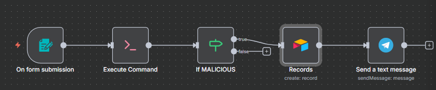
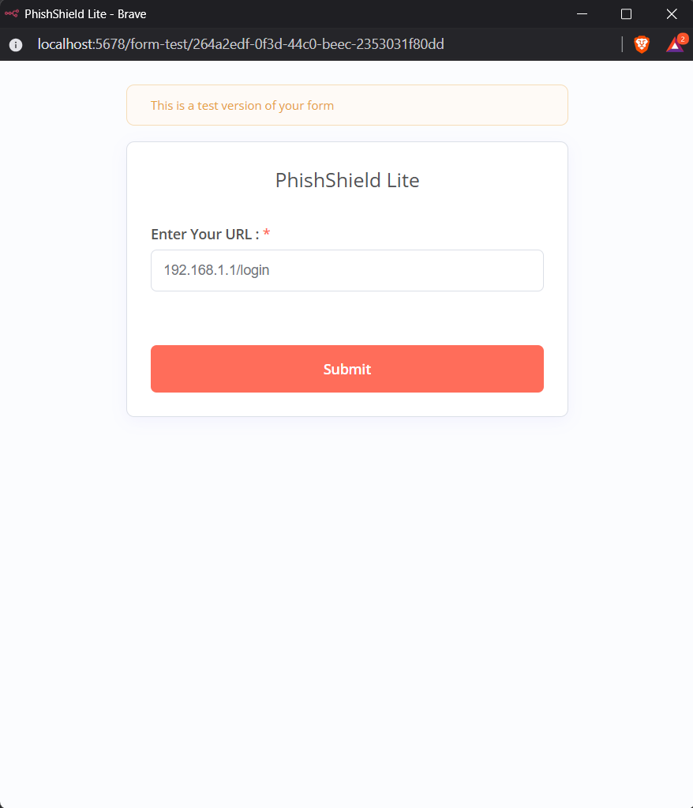
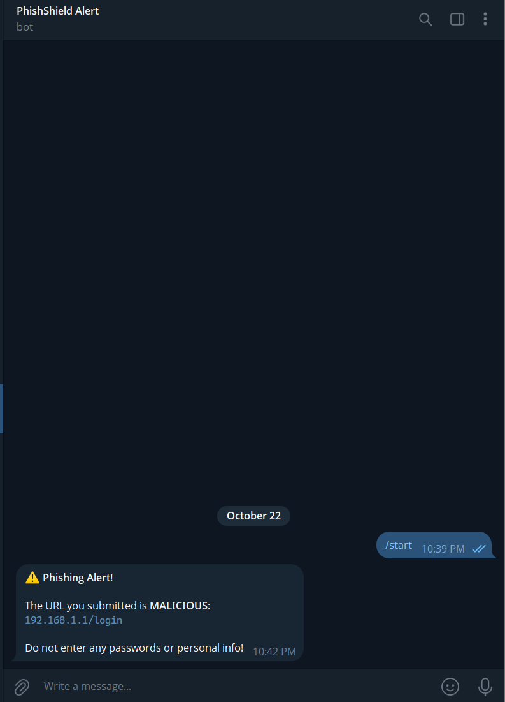
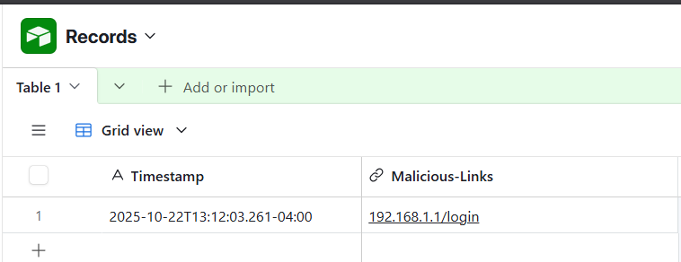

# 🛡️ PhishShield Lite


**Free Phishing Detection Tool for Students**

Built by MASTERxD (aka Yug Dabgar)

> 💡 **100% Self-Hosted** - Runs entirely on your local machine using self-hosted n8n. No cloud services, no data leaves your computer.

---

## What This Does

- ✅ Checks if URLs are phishing/malware
- ✅ Sends Telegram alerts
- ✅ Logs results in Airtable
- ✅ 100% Free - No paid services

---

## Tech Used

- **n8n** - Workflow automation
- **Python** - Detection script
- **URLhaus API** - Malware database
- **PhishStats API** - Phishing database
- **Telegram** - Alerts
- **Airtable** - Logging

---

## How to Use

### 1. Install Python packages
```bash
pip install -r requirements.txt
```
### 2. Test the script
```bash

python core/check_phish.py "https://google.com"
```
Output: **SAFE** or **MALICIOUS**

### How It Works

1. **User submits URL** via a public web form  
2. **Python script** checks four layers:
   - Heuristics (IP addresses, `@` symbols, URL shorteners, excessive sub-domains)
   - URLhaus live malware-URL database
   - PhishStats basic risk score
   - PhishStats advanced score (extra heuristics)
3. **If any layer flags malicious** → instant Telegram alert is sent to the user  
4. **Every scan result** (safe or malicious) is automatically logged to Airtable for auditing and reporting

## Live Practical

### Workflow Overview


1. **User submits URL** via a public web form  
   

2. **Python script** checks four layers:
   - Heuristics (IP addresses, `@` symbols, URL shorteners, excessive sub-domains)
   - URLhaus live malware-URL database
   - PhishStats basic risk score
   - PhishStats advanced score (extra heuristics)

3. **If any layer flags malicious** → instant Telegram alert is sent to the user  
   

4. **Every scan result** (malicious) is automatically logged to Airtable for auditing and reporting  
   

### License  
MIT License - free for educational use.
